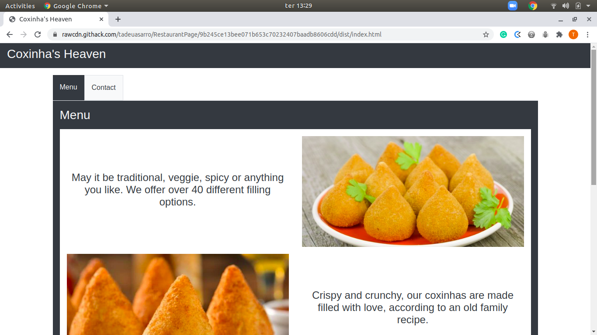

# Restaurant Page

#### Welcome to my Restaurant Page project. The purpose here is to create a restaurant's webpage and add a tab switching feature.

#### Features
- All HTML elements created using ES6;
- Switch between "contact" and "menu" tabs.

#### Screenshot

#### Livedemo
- [Githack](https://rawcdn.githack.com/tadeuasarro/RestaurantPage/9b245ce13bee071b653c70232407baadb8606cdd/dist/index.html)

## Getting started
- run `git clone https://github.com/tadeuasarro/RestaurantPage.git`;
- go to `../dist`;
- open `index.html` with you favorite browser.

## Authors
👤 This is us:

- [Tadeu A Sarro](https://tadeuasarro.web.app)

## Contributing

Contributions, issues and feature requests are welcome!

Feel free to check the [issues page](https://github.com/tadeuasarro/RestaurantPage/issues)

## Show your support

Give a star if you like this project!

## 📝 License

This project is MIT licensed.